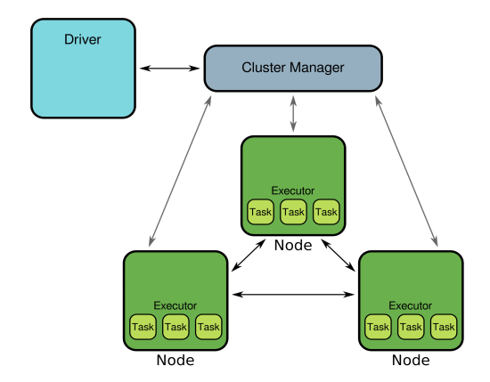
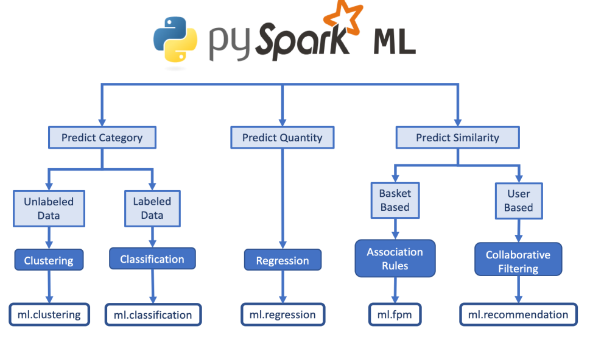
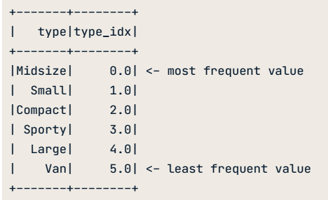
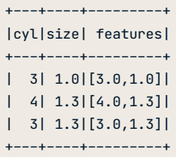
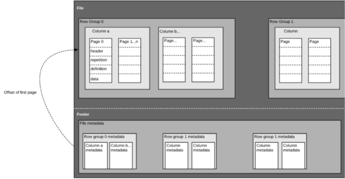

# Pyspark Notes

- [Intro About Spark](#intro-about-spark)
- [Steps:](#steps-)
- [About `SparkSession`](#about-sparksession)
- [About Parquet](#about-parquet)
- [More about `SparkContext`.](#more-about-sparkcontext)
- [About RDD](#about-rdd)
- [About Spark DataFrame](#about-spark-dataframe)
- [Other functions](#other-functions)
- [Map vs flatMap](#map-vs-flatmap)
- [Joining 2 dataframes](#joining-2-dataframes)
- [read and write](#read-and-write)
    - [Read](#read)
    - [Write](#write)
- [Select](#select)
- [Filter: .filter(), .where(), .where(~ )](#filter--filter----where----where----)
- [Creating and Modifying Column](#creating-and-modifying-column)
  * [Dropping/Removing a Column](#dropping-removing-a-column)

<small><i><a href='http://ecotrust-canada.github.io/markdown-toc/'>Table of contents generated with markdown-toc</a></i></small>

## Intro (About Spark)

- Apache Spark or just `Spark` is a **framework for cluster computing** for **processing large quantities of data**. Among **distributed computing technologies**, Spark is currently the most popular technology. 
- Spark consists of a set of clusters. 
- Spark achieves efficiency by distributing data and computation across a cluster of computers. See the figure below for illustration. <br /> A load balancer distributes work across multiple resources, preventing overload on any one resource. In Spark this function is performed by the cluster manager.<br />
  
	
- The master of Spark clusters could be:
	1. remote --> accessed using Spark URL with format: `spark://<IP address | DNS name>:<port>`. <br />
        Example:
        1. `spark://13.59.151.161:7077`. 
        2. `spark://ec2-18-188-22-23.us-east-2.compute.amazonaws.com:7077`.
    2. local <br />
        Example:
        1. local — only 1 core;
        2. local[4] — 4 cores; or
        3. local[*] — all available cores.
- Spark does most processing in memory.
- Spark has a high-level API, which conceals a lot of complexity.
- We can interact with Spark through languages:
	- Java: low-level, compiled
	- Scala, Python (PySpark), R (RSpark): high level, interactive REPL. 
- Checking spark version: `spark.version`. 
- By default, in Spark, data is stored in columnar format called `Apache Parquet`or simply just `Parquet`. 
- SparkContext
- SparkSession
- Two data structures in Spark: RDD and dataframe. 



## About PySpark

1. PySpark is a wrapper API to access Spark through Python language. 
2. To start using PySpark, we have to import `pyspark` first. 
3. In addition to `pyspark`, there are:
    1. `pyspark.sql`: use for importing and creating `SparkSession`. 
    	1. `from pyspark.sql import SparkSession`.
        2. `from pyspark.sql.functions import round`.
    2. `pyspark.streaming`.
    3. `pyspark.ml`.
        
    	1. `from pyspark.ml.feature import StringIndexer` --> Indexing **categorical data** based on frequency in desencing order --> **fit** and **transform** Example of usage: <br />
            ```
            from pyspark.ml.feature import StringIndexer
            indexer = StringIndexer(inputCol='type', outputCol='type_idx')
            indexer = indexer.fit(cars)
            # Create column with index values
            cars = indexer.transform(cars)
            ```
            Output: <br />
        
        
        2. `from pyspark.ml.feature import VectorAssembler` --> vector assembler to transform the data --> **no fit** just **transform**. Note that there are arguments `inputCol` and `inputCols` depend on the number of columns used as inputs. <br />
            Example: <br />
            ```
            from pyspark.ml.feature import VectorAssembler
            assembler = VectorAssembler(inputCols=['cyl', 'size'], outputCol='features')
            assembler.transform(cars)    
            ``` 
        
	
        3. `from pyspark.ml.classification import DecisionTreeClassifier` --> to create classification using decision tree --> ** instantiate - fit - transform**. Usage example: <br />
            ```
            # Import the Decision Tree Classifier class
            from pyspark.ml.classification import DecisionTreeClassifier

            # Create a classifier object and fit to the training data
            tree = DecisionTreeClassifier()
            tree_model = tree.fit(train_data)

            # Create predictions for the testing data and take a look at the predictions
            prediction = tree_model.transform(test_data)
            prediction.select('label', 'prediction', 'probability').show(5, False)
            ```
        4. `from pyspark.ml.classification import LogisticRegression` --> ** instantiate - fit - transform**. <br />
            ```
            from pyspark.ml.classification import LogisticRegression
            logreg = LogisticRegression()
            logreg.fit(train_data)
            
            ```
	
        5. `from pyspark.ml.evaluation import MulticlassClassificationEvaluator, BinaryClassificationEvaluator` --> for evaluating models.
            Usage: <br />
            ```
            from pyspark.ml.evaluation import MulticlassClassificationEvaluator
            evaluator = MulticlassClassificationEvaluator()
            evaluator.evaluate(prediction, {evaluator.metricName: 'weightedPrecision'})
            ```
            Notes: <br/>
                1. argument `prediction` is the output of `.transform()`. 
                2. Options for metrics: `weightedPrecision`, `weightedRecall`, `accuracy`, and `f1`. 
            
            
	    2. dfdre

## Steps:

1. Import `pyspark`, connect to a cluster, and get to know `SparkContext`. 

    1. A cluster consists of **a master and workers**. To connect to a cluster, we first have to create a connection to the `SparkContext`. <br />
    2. Creating the connection is as simple as creating an instance of the `SparkContext` class, with `SparkConf()` constructor. 
    
2. Import `SparkSession`. 
    ```
    # Import SparkSession from pyspark.sql
    from pyspark.sql import SparkSession
    ```
    <br />
    Think of the `SparkContext` as your connection to the cluster (main entry point for creating RDDs) and the `SparkSession` as your interface with that connection.
    
3. create a `SparkSession`. <br />
	Example:
	``` 
	# Create my_spark
	spark = SparkSession.builder.getOrCreate()
	```
    <br />
    We can also specify the cluster's master and appName.<br />
    Example:
    ```
    spark = SparkSession.builder \
                .master('local[*]') \  # meaning using all local nodes. there are other options to define master. 
                .appName('mySparkApp') \
                .getOrCreate()
    ```

4. Start poking around to see what tables is in your cluster using `spark.catalog.listTables()`. Please note that `spark` is the intance of the SparkSession. 

5. Query something from your data using `spark.sql(query)`.
    ```
    # Don't change this query
    query = "SELECT origin, dest, COUNT(*) as N FROM flights GROUP BY origin, dest"

    # Run the query
    flight_counts = spark.sql(query)
    flight_counts.show()
    ```
    
6. If necessary, convert the result to Pandas dataframe using `.toPandas()`. <br />
   Conversion to Pandas is especially needed when plotting PySpark DataFrames using standard libraries like matplotlib or Seaborn. 
   
    ```
    # Convert the results to a pandas DataFrame
    pd_counts = flight_counts.toPandas()

    # Print the head of pd_counts
    print(pd_counts.head())
    ```
    
7. read a csv file: `spark.read.csv(file_path, header=True)`. 
8. close the connection to Spark when you are done using it: `spark.stop()`. 

## About `SparkSession`

1. create a `SparkSession` by importing it from `pyspark.sql`. 
     ```
    # Import SparkSession from pyspark.sql
    from pyspark.sql import SparkSession
    ```
2. SparkSession provides a single point of entry to interact with Spark DataFrames.
3. SparkSession is used to create DataFrame, register DataFrames, execute SQL queries.
4. SparkSession is available in PySpark shell as spark
5. Read more about `SparkSession` [here](https://spark.apache.org/docs/2.3.1/api/python/pyspark.sql.html#pyspark.sql.SparkSession). 
6. Attribute of `SparkSession`:
    1. `.version` --> gives the version of Spark. 
    2. `.builder` --> an instance of the `Builder` class. `.builder` lets us to:
        1. specify the location of the master node
        2. name the application (optional)
        3. retrieve an existing `SparkSession` or, if there is none, create a new one.<br />
            Example: 
            ```
            # Create my_spark
            spark = SparkSession.builder.getOrCreate()
            ```
7. Create a local cluster with format `SparkSession.builder.master('arg').appName('arg').getOrCreate().`. Example: <br />
    ```
    spark = SparkSession.builder \
                .master('local[*]') \
                .appName('first_spark_application') \
                .getOrCreate()
    ```
8. Close connection to Spark: `spark.stop()`. 

## About Parquet


1. Columnar. Thus, it's fast to query column subsets. See the difference between row-based and column-based storage format below. Picture is taken from [xzz201920.medium.com](https://xzz201920.medium.com/what-is-parquet-1db2b92860a5). <br />

2. file extension: `.parq`.
3. The structured: <br />
	a. Parquet is a self-described format -->  each file contains both **data** and **metadata**. 
	b. Parquet files are composed of **row groups**, **header**, and **footer**. 
	c. Each row group contains data from the same columns. The same columns are stored together in each row group. <br />
	 <br />
	*Parquet file structure. Image is taken from [xzz201920.medium.com](https://xzz201920.medium.com/what-is-parquet-1db2b92860a5). 

## More about `SparkContext`.

A **SparkContext** is the entry point to Spark functionality, like a key to your car. SparkContext is automatically created by PySpark in the PySpark shell ( you don't have to create it by yourself) and is **exposed via a variable `sc`**. <br />
`sc` has several properties such as `sc.version`, `sc.pythonVer`, `sc.master`. <br />
`sc` also has several methods such as `sc.parallelize()` and `sc.textFile()`. 

## About RDD

1. RDD stands for resilient distributed dataset. RDD is Spark's core data structure and has a format of a dataframe. It is an immutable distributed collection of objects.
2. In general, RDD can be considered as a normal, with few considerations, of course. 
2. Common methods of RDD:
    1. `df.count()`. 
    2. `df.show()` --> like `.head()`. 
    3. `df.printSchema()`-->  check column types including whether it's nullable or not. 
    4. `df.dtypes` --> another way to check column types, but without the nullable information. 
    5. `df.drop('col1', 'col2')` --> dropping column 1 and 2 from the df. 
    6. `df.select('col1', 'col2')` --> selecting column 1 and 2 from the df. 
    7. `df.dropna()` --> `cars = cars.dropna()`.
    8. `df.filter()` --> exampe: `cars = cars.filter('cyl IS NOT NULL')`, `cars = cars.filter('cyl IS NULL')`. 
    9. `df.withColumn` --> create/modify (mutate) columns. Example:`cars = cars.withColumn('mass', round(cars.weight / 2.205, 0))`.
4. Common attribute of RDD:
    1. `.dtypes`. 
5. RDD can be created using `sc.parallelize()` or `sc.textFile()`. 

    1. `sc.parallelize()` --> Load a list into Spark. <br />
    Example: 
    ```
    # Load the list into PySpark  
    spark_data = sc.parallelize(range(1,10))
    ```
    2. `sc.textFile(file_path, minPartitions)` --> load data from a local file. 
    
6. Remember that RDD are spread into several partitions (nodes). Thus, to show the RDD as a whole, use `rdd_name.collect()`. It is usually used after `filter()`, `group()`, `count()`, `map()`, etc.  <br />

    Example:
    ```
    In [3]:
    sc.parallelize(range(1,5))
    Out[3]:
    PythonRDD[23] at RDD at PythonRDD.scala:49
    In [4]:
    sc.parallelize(range(1,5)).collect()
    Out[4]:
    [1, 2, 3, 4]
    ```
 7. pair RDD = RDD in a key-value format. .
    
### What can we do with RDD?

#### 1. RDD Transformation

1. `rdd_name.map()` --> one-to-one transformation. The `map()` transformation takes in a function and applies it to each element in the RDD. <br />
    Example: 
    ```
    # Square all numbers in my_list
    squared_list_lambda = list(map(lambda x: x**2, my_list))

    # Create map() transformation to cube numbers
    cubedRDD = numbRDD.map(lambda x: x**3)
    ```
    
2. `rdd_name.flatMap()` --> one-to [0, 1, many] transformation --> similar to `map()` but it can return > 1 result for each element in the RDD. <br />
    Example:
    ```
    # Split the lines of baseRDD into words
    splitRDD = baseRDD.flatMap(lambda x: x.split())
    ```
    
3. `rdd_name.filter()` <br />
    Example:
    ```
    splitRDD_no_stop = splitRDD.filter(lambda x: x.lower() not in stop_words)
    ```
4. `rdd_name.reduce()` --> aggregating the elements of a regular RDD.
5. `rdd_name.reduceByKey()` --> for pair RDD only. operates on key, value (k,v) pairs and merges the values for each key. <br />
   Example:
   ```
   # Create PairRDD Rdd with key value pairs
   Rdd = sc.parallelize([(1,2), (3,4), (3,6), (4,5)])

   # Apply reduceByKey() operation on Rdd
   Rdd_Reduced = Rdd.reduceByKey(lambda x, y: x + y)

   # Iterate over the result and print the output
   for num in Rdd_Reduced.collect(): 
     print("Key {} has {} Counts".format(num[0], num[1]))
   ```

   Output:
   ```
   Key 1 has 2 Counts
   Key 3 has 10 Counts
   Key 4 has 5 Counts
   ```
6. `rdd_name.sortByKey()` --> for pair RDD only.
7. `rdd_name.countByKey()` --> for pair RDD only. count the number of keys in a key/value dataset.
8. `rdd_name.groupByKey()`
9. `rdd_name.union()`.
10. `rdd_name.collectAsMap()` --> return the key-value pairs in the RDD as a dictionary. 
    Example:
    ```
    In [1]:
    sc.parallelize([(1, 2), (3, 4)]).collectAsMap()
    Out[1]:
    {1: 2, 3: 4}
    ```

<br /><br />
Note that `.map()`, `.filter()`, and `.reduceByKey()` are often combined with `lambda()`. 

#### 2. RDD Action

1. `rdd_name.count()` --> count the number of items in the RDD. <br />
   Example:
   ```
   In [2]:
   myrdd = sc.parallelize(range(1,5)).count()
   In [3]:
   myrdd
   Out[3]:
   4
   ```
2. `rdd_name.take(n)` --> show the first n items of the RDD. `.take(n)` is similar to `.collect()` except that it only show n items instead of all items. <br />
   Example:
   ```
   In [5]:
   myrdd = sc.parallelize(range(1,5)).take(3)
   In [6]:
   myrdd
   Out[6]:
   [1, 2, 3]
   ```
3. `rdd_name.first()` --> prints the first element of the RDD.
4. `rdd_name.getNumPartitions()` --> get the number of partitions in an RDD.
5. `rdd_name.saveAsTextFile('filename')` --> save RDD into text files
6. `rdd_name.coalesce(1).saveAsTextFile('filename')` --> save RDD as a single text file. 

        
## About Spark DataFrame

1. Spark DataFrame is **immutable**. This means that it can't be changed, and so columns **can't be updated in place**. 

2. Create spark dataframe using `spark.table()`.

3. Create spark dataframe from external file. 

    1. From a csv file: `spark.read.csv('filename', header=True)`.

3. Convert RDD to dataframe, using `spark.createDataFrame(rdd, [schema])`. <br />
   The output of this method is stored locally, not in the `SparkSession` catalog. This means that you can use all the Spark DataFrame methods on it, but you can't access the data in other contexts. For example, a SQL query (using the `.sql()` method) that references your DataFrame will throw an error. <br />
   To access the data in this way, you have to save (register) it to the `SparkSession` as a temporary table using the method `.createOrReplaceTempView()`. See the illustration below. 
    

4. To overwrite the original DataFrame you must **reassign** the returned DataFrame using the method like so:
    ```
    df = df.withColumn("newCol", df.oldCol + 1)
    ```

5. Do a column-wise operation --> use `.withColumn("column_name")`. 

6. Filtering a spark dataframe based on certain characteristics.
    1. use `.filter("sql_string")` --> example: `flights.filter("air_time > 120")`.
    2. use `.filter(Spark Column of boolean)` --> example: `flights.filter(flights.air_time > 120)`.
    
7. Spark only handles numeric data. That means all of the columns in your DataFrame must be either integers or decimals (called 'doubles' in Spark).

8. Print the schema of spark df column: 

9. Subsetting --> `df.select('col1', 'col2', ..., 'coln')`.
   Example: `people_df_sub = people_df.select('name', 'sex', 'date of birth')`.
   
10. drop duplicate entries --> `df.dropDuplicates()`.


## Spark DataFrame Schema

1. create a new schema using `StructType()` and `StructField('col_name', dataType, nullable=True)`.
    Example:
    ```
    DogType = StructType([
	StructField("breed", StringType(), False),
    StructField("start_x", IntegerType(), False),
    StructField("start_y", IntegerType(), False),
    StructField("end_x", IntegerType(), False),
    StructField("end_y", IntegerType(), False)
	])
    ```
    
2. viewing a schema of a Spark's dataframe, using `df.printSchema()`. 


## Spark's User Defined Function (UDF)

1. Wrapped via the `pyspark.sql.functions.udf` method. 
2. Stored as a variable.
3. Called like a normal Spark function.
4. Steps to create a UDF:
	
	1. Define the function
	2. convert it as UDF
	3. call like a normal spark function. <br />
	Example:
	```
	def reverseString(mystr):
		return mystr[::-1]
		
	udfReverseString = udf(reverseString, StringType())
	
	user_df = user_df.withColumn('ReverseName', udfReverseString(user_df.Name))
	```
	


## Other functions

1. Aggregating --> The GroupedData methods --> must be preceded by `.groupBy()`.
    1. ```df.groupBy().min("col").show()```
    2. ```df.groupBy().max("col").show()```
    3. ```df.groupBy().count("col").show()``` <br />
    4. `.avg()` --> `flights.filter("carrier == 'DL'").filter("origin == 'SEA'").groupBy().avg("air_time").show()`. 
2. `.cast()`  --> convert all the appropriate columns from your DataFrame model_data to integers. 
3. `spark.createDataFrame(data, schema=None, samplingRatio=None, verifySchema=True)` --> Create a Spark dataframe. Please note that we use the object `spark` (a spark session) instead of `sc` (a spark context). The argument `schema` is a list of column names.


## Joining 2 dataframes
1. df1.union(df2)


## read and write

### Read

1. `spark.read.format('format_name')`  --> eg: `spark.read.format('csv')`.
2. `spark.read.format_name` --> eg: 

    1. `spark.read.parquet('asdf.parquet)`.
    2 [`df_csv = [spark.read.csv("file.csv", schema=None, sep=None, header=None, inferSchema=None, nullValue=None, nanValue=None)`](https://spark.apache.org/docs/latest/api/python/pyspark.sql.html?highlight=read%20csv#pyspark.sql.DataFrameReader) --> create a dataframe from a csv file. <br />
    The options:
        1. `schema` = schema – an optional `pyspark.sql.types.StructType` for the input schema or a DDL-formatted string (For example `col0 INT, col1 DOUBLE`). Schema can be defined using function `StructType([])`. Example:
        
		```
        schema = StructType([
                    StructField("maker", StringType()),
                    StructField("model", StringType()),
                    StructField("origin", StringType()),
                    StructField("type", StringType()),
                    StructField("cyl", IntegerType()),
                    StructField("size", DoubleType()),
                    StructField("weight", IntegerType()),
                    StructField("length", DoubleType()),
                    StructField("rpm", IntegerType()),
                    StructField("consumption", DoubleType())
                    ])
		```
        2. `sep` = separator. default = `,`. 
        3. `header` = uses the first line as names of columns. default = `False`. 
        4. `inferSchema` =  infers input schema automatically from data, default = `False`. 
        5. `nullValue` = string representation of a null value, default empty string (`" "`). 
        6. `nanValue` = string representation of a non-number value, default `NaN`.
    3 `df_txt = spark.read.txt("file.txt", header=True, inferSchema=True)` --> create a dataframe from a txt file.
    4 `df_json = spark.read.json("file.json", header=True, inferSchema=True)` --> create a dataframe from a json file.
    5 `df = spark.read.format('csv').options(Header=True).load('file_name.csv')`

### Write
1. `spark.write.format('format_name_type')` --> eg: `df3.write.parquet('AA_DFW_ALL.parquet', mode='overwrite')`. 

    
    
    csv(path, schema=None, sep=None, header=None, inferSchema=None, nullValue=None, nanValue=None)

## Select

```
# 1. select distinct
# Show the distinct VOTER_NAME entries
voter_df.select('VOTER_NAME').distinct().show(40, truncate=False)

# 2. Show the distinct VOTER_NAME entries again
voter_df.select('VOTER_NAME').distinct().show(40, truncate=False)
```

## Filter: .filter(), .where(), .where(~ )
```
# `. filter
# Filter voter_df where the VOTER_NAME is 1-20 characters in length
voter_df = voter_df.filter('length(VOTER_NAME) > 0 and length(VOTER_NAME) < 20')

# 2. filter not & contains
# Filter out voter_df where the VOTER_NAME contains an underscore
voter_df = voter_df.filter(~ F.col('VOTER_NAME').contains('_'))

# 3. filter only
users_df = users_df.filter(users_df.Name.isNotNull())

# 3b. filter not
users_df = users_df.filter(~ col('Name').isNull())

# 4. filter where
users_df = users_df.where(users_df.ID == 18502)

# 5. filter where not
users_df = users_df.where(~ (users_df.ID == 18502) )
```

## Creating and Modifying Column

1. Adding new column --> using `.withColumn()`. Can be varied with `.when()` and `.otherwise()`.

    ```
    # Add a new column called splits separated on whitespace
    voter_df = voter_df.withColumn('splits', F.split(voter_df.VOTER_NAME, '\s+'))

    # Create a new column called first_name based on the first item in splits
    voter_df = voter_df.withColumn('first_name', voter_df.splits.getItem(0))

    # Get the last entry of the splits list and create a column called last_name
    voter_df = voter_df.withColumn('last_name', voter_df.splits.getItem(F.size('splits') - 1))

    # Add a column to voter_df for any voter with the title **Councilmember**
    voter_df = voter_df.withColumn('random_val', F.when(voter_df.TITLE == 'Councilmember', F.rand()))

    # Add a column to voter_df for a voter based on their position
    voter_df = voter_df.withColumn('random_val',
                                   when(voter_df.TITLE == 'Councilmember', F.rand())
                                   .when(voter_df.TITLE == 'Mayor', 2)
                                   .otherwise(0))
    ```
    
2. Rename column --> using `.withColumnRenamed('old_name', 'new_name')`.
    Example:
    ```
    valid_folders_df = valid_folders_df.withColumnRenamed('_c0', 'folder')
    ```

### Dropping/Removing a Column

#### Dropping 1 column only
```
# Drop the splits column
voter_df = voter_df.drop('splits')
```

#### Dropping multiple columns. 

1. put all the columns to drop in a list. 
2. drop it them all at once using `*`. <br />

Example:
```
# List of columns to remove from dataset
cols_to_drop = ['col1', 'col2']

# Drop columns in list
df = df.drop(*cols_to_drop)
```
