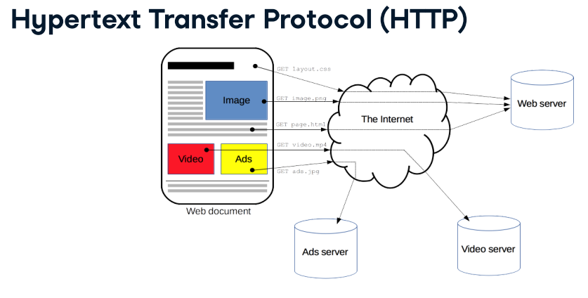

# Web Scraping

- [Understanding Basic HTTP](#understanding-basic-http)
- [Understanding Basic Web](#understanding-basic-web)
    - [Web Component](#web-component)
    - [Understanding Request and Response](#understanding-request-and-response)
- [The Ethics](#the-ethics)
- [Tools](#tools)
- [Steps in R](#steps-in-r)
- [Extracting Functions](#extracting-functions)
- [Selectors](#selectors)
    - [CSS Selectors](#css-selectors)
    - [XPATH](#xpath)
    - [CSS Selectors vs XPATH](#css-selectors-vs-xpath)
- [About API](#about-api)
- [Working with Websites with Formal API](#working-with-websites-with-formal-api)
- [Working with Websites with Non Formal API](#working-with-websites-with-non-formal-api)
- [Resources](#resources)

## Understanding Basic HTTP

*[https://developer.mozilla.org/en-US/docs/Web/HTTP/Overview](https://developer.mozilla.org/en-US/docs/Web/HTTP/Overview)*

## Understanding Basic Web

<figcaption> The web overview. Image is taken from <a href="https://developer.mozilla.org/en-US/docs/Web/HTTP/Overview">https://developer.mozilla.org/en-US/docs/Web/HTTP/Overview</a></figcaption>

### Web Component:
1. Server
2. Client, e.g. browsers (Firefox, Chrome, etc.), crawler, [CURL](https://en.wikipedia.org/wiki/CURL), headless browser ([PhantomJS](https://phantomjs.org/), [Selenium](https://www.selenium.dev/)). 
3. Request and response

### Understanding Request and Response
1. A request is sent to the web server. A request is basically a conversation between client machine and the server. What you reqeust is what you want to happen. There are 7 types of [`http request`](https://www.w3schools.com/tags/ref_httpmethods.asp), such as `GET`, `POST`, `HEAD`, `PUT`, `DELETE`, `PATCH`, `OPTIONS`. These all can be done by utilizing the library `httr`. In here, we'll just discuss about:
    1. **GET**: 
        1. Used to fetch a resource without submitting data ( GET /index.html ). 
        2. Usage: [`GET(url = NULL, config = list(), ...)`](https://www.rdocumentation.org/packages/httr/versions/1.4.2/topics/GET). 
        3. Example of a GET request:<br />
         <br />
        <figcaption> Example of a GET request from client. Image is taken from <a href="https://developer.mozilla.org/en-US/docs/Web/HTTP/Overview">https://developer.mozilla.org/en-US/docs/Web/HTTP/Overview</a></figcaption> <br />
    2. **POST**: 
        1. Used to send data to a server, e.g. after filling out a form on a page. 
        2. Usage: [`POST(url = NULL, body = NULL)`](https://www.rdocumentation.org/packages/httr/versions/1.4.2/topics/POST). 
        3. Example: <br />
            ```
            > library(httr)
            > post_result <- POST('http://httpbin.org/post', body = "this is a test")
            > post_result
            Response [http://httpbin.org/post]
              Date: 2021-01-04 00:52
              Status: 200
              Content-Type: application/json
              Size: 524 B
            {
              "args": {}, 
              "data": "this is a test", 
              "files": {}, 
              "form": {}, 
              "headers": {
                "Accept": "application/json, text/xml, application/xml, */*", 
                "Accept-Encoding": "deflate, gzip", 
                "Cache-Control": "max-age=259200", 
                "Content-Length": "14", 
            ...
            ```
        3. Example of how a GET request looks like (phy:<br />
         <br />
        <figcaption> Example of a POST request from client. Image is taken from <a href="https://developer.mozilla.org/en-US/docs/Web/HTTP/Overview">https://developer.mozilla.org/en-US/docs/Web/HTTP/Overview</a></figcaption> <br />
    
2. For every request from client, server will reply with a response, which is the web page that we see. 
    1. in the page: header, body, footer. 
    2. header provides: [status code and status message](https://developer.mozilla.org/en-US/docs/Web/HTTP/Status). Response status codes are grouped into 5 classes:
        1. Informational responses (100–199), e.g.: 101 = "switching protocol"
        2. Successful responses (200–299), e.g.: 200 = "OK"
        3. Redirects (300–399), e.g.: 301 = "moved permanently"
        4. Client errors (400–499), e.g.: 403 = "forbidden", 404 = "not found"
        5. Server errors (500–599), e.g.: 500 = "internal server error", 504 = "gateway timeout". 
    3. Example of response: <br />
         <br />
        <figcaption> Example of a response from server. Image is taken from <a href="https://developer.mozilla.org/en-US/docs/Web/HTTP/Overview">https://developer.mozilla.org/en-US/docs/Web/HTTP/Overview</a></figcaption> <br />

## The Ethics

1. When a client send a request, web server already registers the client's IP address. So, it's strongly encouraged for the clients to tell who they are by defining the `user agent`. Bits of text that ID your browser and gives the server some idea of what you're trying to do. We can define `user agent` by modifying the request headers with library `httr`. It is always a good idea to provide informative `user agent` such as by adding an email address so the web owner can contact us should problems happen. There are 2 ways for setting a customized user agents:

    - `response <- GET('http://example.com', user_agent("Hey, it's me, Timo! Reach me at timo@timogrossenbacher.ch."))`.
    - `set_config(add_headers(`User-Agent` = "Hey, it's me, Timo! Reach me at timo@timogrossenbacher.ch.")) response <- GET('http://example.com')`.

2. Be gentle and add wait time between requests --> don't overwhelm the server. 
3. Overwhelmed server = none can use it. 
4. APIs issue "access tokens" to control and identify use. 

## Tools

1. R --> Required libraries:
    1. rvest
    2. rselenium
    3. [httr](https://www.rdocumentation.org/packages/httr/versions/1.4.2): tools for working with URLs and HTTP. Some of its useful functions:
        1. [`GET(url = NULL, config = list(), ...)`](https://www.rdocumentation.org/packages/httr/versions/1.4.2/topics/GET).
        2. `POST()`
        3. [`http_error()`](https://www.rdocumentation.org/packages/httr/versions/1.4.2/topics/http_error)  --> Check for an http error. <br />
            Usage: `http_error(request_result)` --> `request_result` is things we got from `GET()` or `POST()`.
        4. [`http_type`](https://www.rdocumentation.org/packages/httr/versions/1.4.2/topics/http_type) --> Extract the content type of a response. <br />
            ```
            > ctn <- GET('https://content.iospress.com/articles/statistical-journal-of-the-iaos/sji200755')
            > http_type(ctn)
            [1] "text/html"
            > ctn2 <- GET('https://coms.events/ntts2019/data/x_abstracts/x_abstract_49.pdf')
            > http_type(ctn2)
            [1] "application/pdf"
            ```
        5. [`content(request_result, as = NULL)`](https://www.rdocumentation.org/packages/httr/versions/1.4.2/topics/content) --> Extract content from a request. Notes: <br />
            1. `as` = desired type of output: `raw`, `text` or `parsed`. `content()` attempts to automatically figure out which one is most appropriate, based on the content-type.
            
    4. [htmltools](https://www.rdocumentation.org/packages/htmltools/versions/0.5.0): tools for HTML generation and output. <br />
        Some of its important functions:
        1. save_html(html, file, background = "white", libdir = "lib")[https://www.rdocumentation.org/packages/htmltools/versions/0.5.0/topics/save_html]: Save the specified HTML object to a file. 
    5. tidyverse:
        1. 
    6. [textreadr](https://www.rdocumentation.org/packages/textreadr/versions/1.0.2) --> html_read. 
    7. [xml2](https://www.rdocumentation.org/packages/xml2/versions/1.3.2) --> Work with XML files using a simple, consistent interface. Built on top of the 'libxml2' C library. Some of its useful functions:
        1. [`read_xml(content_object)`](https://www.rdocumentation.org/packages/xml2/versions/1.3.2/topics/read_xml) --> Read HTML or XML. `content_object` = `content(GET(url))`. 
        2. [`xml_structure(html_xml_document)`](https://www.rdocumentation.org/packages/xml2/versions/1.3.2/topics/xml_structure) --> Show The Structure Of An Html/Xml Document. 
        3. [`xml_find_all(read_xml_output, xpath)`](https://www.rdocumentation.org/packages/xml2/versions/1.3.2/topics/xml_find_all) --> extract nodes that match a given XPATH --> returns a nodeset.  <br />
            Example: <br />
            ```
            xml_find_all(rev_xml, "/api/query/pages/page/revisions/rev")
            ```
            <br />
            Output <br />
            ```
            {xml_nodeset (5)}
            [1] <rev user="214.28.226.251" anon="" timestamp="2015-01-14T17:12:45Z" comme ...
            [2] <rev user="73.183.151.193" anon="" timestamp="2015-01-15T15:49:34Z" comme ...
            [3] <rev user="FeanorStar7" timestamp="2015-01-24T16:34:31Z" comment="/* Exte ...
            [4] <rev user="KasparBot" timestamp="2015-04-26T19:18:17Z" comment="authority ...
            [5] <rev user="Spkal" timestamp="2015-05-06T18:24:57Z" comment="/* Bibliograp ...
            ```
        4. [`xml_find_first()`](https://www.rdocumentation.org/packages/xml2/topics/xml_find_first) --> works just like `xml_find_all()` but it only extracts the first node it finds.
        5. [`xml_text()`](https://www.rdocumentation.org/packages/xml2/versions/1.3.2/topics/xml_text) --> extract text from `xml_find_alll()`. 
        6. `xml_double()`
        7. `xml_integer()`
        8. [xml_attrs(nodeset)](https://www.rdocumentation.org/packages/xml2/topics/xml_attrs) --> takes a nodeset and returns all of the attributes for every node in the nodeset.  <br />
            Example:
            ```
            # Find all attributes with xml_attrs()
            xml_attrs(first_rev_nodes)
            ```
            Output:
            ```
            xml_attrs(first_rev_node)
                          user                   anon              timestamp 
              "214.28.226.251"                     "" "2015-01-14T17:12:45Z" 
                       comment          contentformat           contentmodel 
                            ""          "text/x-wiki"             "wikitext" 
                         space 
                    "preserve" 
            ```
            
        9. [xml_attr(nodeset, 'attr')](https://www.rdocumentation.org/packages/xml2/topics/xml_attr) --> takes a nodeset and an additional argument `attr` to extract a single named argument from each node in the nodeset. If the nodesset does not have the requested attribute, it will return `NA`.<br />
            Example: 
            ```
            xml_attr(rev_nodes, 'anon')
            [1] "" "" NA NA NA
            ```
    
2. python --> scrapy, beautiful soup. 


## Steps in R:
1. Check your browser's user agent. We can do this by harnessing a special test platform address [**https://httpbin.org/headers**](https://httpbin.org/headers) that returns the headers of each request that it reaches. User agent can be customized to make it meaningful for the owners of the website you're scraping.<br />
    Example:
    ```
    # Access https://httpbin.org/headers with httr
    response <- GET('https://httpbin.org/headers')
    # Print its content
    print(content(response))
    ```
    Output:
    ```
    $headers
    $headers$Accept
    [1] "application/json, text/xml, application/xml, */*"

    $headers$`Accept-Encoding`
    [1] "deflate, gzip"

    $headers$Host
    [1] "httpbin.org"

    $headers$`User-Agent`
    [1] "libcurl/7.47.0 r-curl/4.3 httr/1.4.2"

    $headers$`X-Amzn-Trace-Id`
    [1] "Root=1-5fecea90-2502f62e7222025f605f9d58"
    ```
    From the example above, we can see that the user agent is `libcurl/7.47.0 r-curl/4.3 httr/1.4.2`.
2. Send [HTTP requests](#understanding-request-and-response). As mentioned earlier, we will just be focusing on `GET` and `POST`. We can do it by either:
    1. using `read_html(url)` function from library `textreadr()` and assign it to a variable. 
        Example:
        ```
        library(textreadr)
        myhtml <- read_html("https://www.atlasai.co/")
        ```
    2. using [`GET(url = NULL, config = list(), ...)`](https://www.rdocumentation.org/packages/httr/versions/1.4.2/topics/GET) or [`POST(url)`](https://www.rdocumentation.org/packages/httr/versions/1.4.2/topics/POST) from library `httr`. <br />
        1. Arguments:
            1. url = url of the page to retrieve, write as string (enclosed in quotes). 
            2. config = Additional configuration settings such as http authentication (`[authenticate()](https://www.rdocumentation.org/link/authenticate()?package=httr&version=1.4.2&to=%3Dauthenticate)`), additional headers (`[add_headers()](https://www.rdocumentation.org/link/add_headers()?package=httr&version=1.4.2&to=%3Dadd_headers)`), cookies (`[set_cookies()](https://www.rdocumentation.org/link/set_cookies()?package=httr&version=1.4.2&to=%3Dset_cookies)`) etc. See `[config()](https://www.rdocumentation.org/link/config()?package=httr&version=1.4.2&to=%3Dconfig)` for full details and list of helpers
            3. ... = various optional arguments, such as:
                1. `user_agent('customized user agent')` --> example: `response <- GET('https://httpbin.org/user-agent', user_agent("Erika user agent"))`. <br />
                Alternative way to modify `user agent` is by setting it globally using ``set_config(add_headers(`User-Agent` = "the modified user agent"))``.  <br />
                Example:
                    ```
                    # Globally set the user agent
                    set_config(add_headers(`User-Agent` = "A request from a DataCamp course on scraping"))
                    # Pass a custom user agent to a GET query to the mentioned URL
                    response <- GET("https://httpbin.org/user-agent")
                    # Print the response content
                    content(response)
                    ```
                2. `query`--> To construct a parameter-based URLs, where all the query values exist at the end of the URL and take the form of `key=value`. Example: <br />
                    ```
                    # Create list with nationality and country elements
                    query_params <- list(nationality = "americans", 
                        country = "antigua")

                    # Make parameter-based call to httpbin, with query_params
                    parameter_response <- GET('https://httpbin.org/get', query = query_params)

                    # Print parameter_response
                    print(parameter_response)
                    ```
                    Output:
                    ```
                    print(parameter_response)
                    Response [https://httpbin.org/get?nationality=americans&country=antigua]
                      Date: 2021-01-04 14:57
                      Status: 200
                      Content-Type: application/json
                      Size: 465 B
                    {
                      "args": {
                        "country": "antigua", 
                        "nationality": "americans"
                      }, 
                      "headers": {
                        "Accept": "application/json, text/xml, application/xml, */*", 
                        "Accept-Encoding": "deflate, gzip", 
                        "Host": "httpbin.org", 
                        "User-Agent": "libcurl/7.47.0 r-curl/4.3 httr/1.4.1", 
                    ...
                    ```
          
        2. Example:
        ```
        library(httr)
        myhtml <- GET("https://www.atlasai.co/")
        ```

3. Check the [status code](https://en.wikipedia.org/wiki/List_of_HTTP_status_codes) of the response using function `status_code()` from library [`httr`](https://www.rdocumentation.org/packages/httr/versions/1.4.2). <br />
    Example:
    ```
    > status_code(myhtml)
    [1] 200
    ```
4. Parse the reading response into an HTML doc.   
    1. using the function `html_nodes()` from library `htmltools`. 
        ```
        myhtml %>%
          html_nodes()
        ```
    2. using `content()` from library [`httr`](https://www.rdocumentation.org/packages/httr/versions/1.4.2). 
        Example:
        ```
        content(myhtml)
        ```
5. Extract the intended nodes using function `html_nodes()` and `html_text()` from library `rvest`. <br />
    Example: 
    ```
    myhtml %>% 
        html_nodes(xpath = '//table//tr[position() = 9] /td') %>% 
        html_text()
    ```

## Extracting functions
1. html_node()
2. html_nodes(args)  --> args = css selectors or xpath. 
  a. using css selector: `html_nodes('div p')`.
  b. using xpath: `html_nodes(xpath = '//div//p')`.
3. html_text()
4. html_table()
5. read_html() -->  issues an HTTP GET request if provided with a URL. 

All the function above can be combined together. Example: 
```
# extracting table from html
mytable <- myhtml %>% 
  html_node(xpath = "//table") %>% 
  html_table()
# Print the contents of the role data frame
print(mytable)
```

## Selectors

Select intended node using css selectors or xpath wrapped as argument(s) in method `html_nodes()`. 

### css selectors

1. Selecting nodes or component using either:
    1. type (e.g.: `p`, `h2`)
    2. class (`.`)
    3. id (`#`)
    4. or combination of the four things above. 
2. Using selectors:
    1. selecting 1 type --> `html %>% html_nodes('type')`.
    2. selecting > 1 types, seperate them by comma (`,`) --> `html %>% html_nodes('type1, type2')`.
    3. all, use `*` --> `html %>% html_nodes('*')`.
    4. select by class (`.`) --> `html %>% html_nodes('.alert')`.
    5. select by > 1 class (`.class1.class2`) --> `html %>% html_nodes('.alert.emph')`.
    6. select by id (`#`) --> `html %>% html_nodes('#special')`.
    7. select by type and class (`type.class`) --> `html %>% html_nodes('a.alert')`.
    8. select by type and id (`type#id`) --> `html %>% html_nodes('div#special')`.
    9. select by element's position (`pseudo-class`):
        1. first (`:first-child`) --> `html %>% html_nodes('li:last-child')`.
        2. last (`:last-child`) --> `html %>% html_nodes('p:last-child')`.
        3. nth (`:nth-child(n)`) --> `html %>% html_nodes('h3:nth-child(5)`.
3. Family combinators:
    1. Structure: `h2#someid {space|>|+|~} .someclass`.
        1. `space`: descendant combinator --> example: `html %>% html_nodes('div.first a')` --> get all `a`s that are the descendant of `div.first`. 
        2. `>` : child combinator --> example: `html %>% html_nodes('div.first > a')` --> Select all `a`s that are direct children of `div.first`. 
        3. `+` : adjacent sibling combinator --> example: 
            1. `html %>% html_nodes('div.first + div')` --> get the `div` which is a sibling of `div.first`. 
            2. HTML:
                ```
                <div>
                    <h1>First</h1>
                    </div>
                    <div>
                    <p>Some text.</p>
                    <p>More text.</p>
                    </div>
                ```
                <br />
                `html %>% html_node()`
        4.  `~` : general sibling combinator --> example: 
            1. `html %>% html_nodes('div.first ~ div')`.
            2. `html %>% html_nodes('div.first ~ *')`.

### xpath

1. Define web nodes hierarchically using single slash `/` and double slashes `//`.
2. `/node_name` specifies nodes at the **current level** that have the tag `node_name`, where as `//node_name` specifies nodes at **any level** below the current level that have the tag `node_name`.
3. Mostly start with double slash `//`. Next element use single slash `/`. 
4. specify class, id, css, position, count, etc using **predicate** `[...]`. 
5. provide special predicated functions which are unavailable in the `css selectors` version:
    1. position() --> to select element located in certain position. 
    2. count() --> select element that has certain number of children/siblings/etc. 
    3. text() --> select element that has certain text. 


### css selectors vs xpath

| No 	| css selectors 	| xpath 	| explanation 	|
|:-:	|:-	|:-	|:-	|
| 1 	| div > p.blue 	| //div/p[@class = "blue"] 	| - [..] = predicate<br>- @ for class 	|
| 2 	| ul.list > li:nth-child(5), ul.list > li:last-child, ul.list > li.special 	| //ul[@class = "list"]/li[position() > 4 or @class = "special"] 	| position() =, < , <=, >, >=, !=<br><br>--> for selecting the nth element<br>--> position starts from 1 	|
| 3 	|  	| - //ol/li[position() != 3 and @class = "blue"]<br>- //ol/li[position() != 3 or @class = "blue"] 	| combining xpath: 'and', 'or' 	|
| 4 	| *<br>html %>% html_nodes('*') 	|  	| get all nodes 	|
| 5 	|  p 	| //p 	| find all p 	|
| 6 	| body p 	| //body//p 	| find p that is the descendant of body (not necessary be a direct child) 	|
| 7 	| body, p 	|  	| find body and p (no descendant relationship required) 	|
| 8 	| html > body p 	| /html/body//p 	|  	|
| 9 	| div > p 	| //div/p 	| find p that is a direct child of div.  	|
| 10 	|  	| //div[a] 	| select 'a' that is a direct child of 'div' 	|
| 11 	| span > a.external 	| //span/a[@class = "external"] 	|  	|
| 12 	| #special div   or <br>*#special div 	| //*[@id = "special"]//div 	|  	|
| 13 	| ol > li:nth-child(2) 	| //ol/li[position() = 2] 	|  	|
| 14 	| - 	| - html %>% html_nodes(xpath = '//ol[count(li) = 2]')<br>- html %>% html_nodes(xpath = '//ol[count(li) > 2]') 	| - count()<br>- select element that has certain number of children. In this example, it's 2 	|
| 15 	| #cast td.role 	| //*[@id = "cast"]//td[@class = "role"] 	|  	|
| 16 	| table td.role > text() 	| html_nodes(xpath = '//table//td[@class = "role"]/text()') 	| - text() --> select elements (and their parents) based on their text<br>- text() is put in predicate- apakah yg css selectornya benar? 	|
| 17 	| #cast td.role 	| //*[@id = "cast"]//td[@class = "role" and text() = " (Voice)"] 	| apa 'and' di css selectors? 	|
| 18 	|  	| ..<br>--> html_nodes(xpath = '..') 	| selects the parent of each selected element. It's normally preceded by children selection first. See the next row for a better explanation 	|
| 19 	|  	| html_nodes(xpath = '//*[@id = "cast"]//td[@class = "role" and text() = " (Voice)"]') %>%<br><br>html_nodes(xpath = '..') # selects the parent (tr) of each selected td element 	|  	|
| 20 	| .alert.emph<br>--> html_nodes('.alert.emph') 	| //*[@class="alert" and @class="emph"] 	| apakah benar begini cara ngambil 2 class dg xpath? 	|
| 21 	|  	| html_nodes(xpath = 'em[text() = "twice"]' 	| Select all em elements that have "twice" as text 	|
| 22 	| html %>% html_nodes('li:first-child') 	|  	| selecting the first child, in this case, of li element 	|
| 23 	| html %>% html_nodes('li:last-child') 	|  	| selecting the last child, in this case, of li element 	|
| 24 	| html %>% html_nodes('li:nth-child(4)') 	|  	| - selecting the 4th child, in this case, of li element<br>- first-chid, last-child, and nth-child are called pseudo-class 	|
| 25 	| p, div 	|  	| multiple types<br>--> <p>...</p><div>...</div> 	|
| 26 	| .x.y 	|  	| multiple classes<br>--> <p class = 'x y'>...</p> 	|
| 27 	| table tr:nth-child(9) > td 	| html_nodes(xpath = '//table//tr[position() = 9] /td') 	|  	|


## Obtaining Data from an URL

1. Importing. <br />
    Use the function `read.xxx()` from `basic R` function or `read_xxx()` , where `xxx` is the type of the file to download from the internet.  `read.csv('url')` which is a basic R function or use `read_csv('url)` from library `readr`. <br />
    Example: <br />
    
        1. `read.csv("http://website.url/remote-file.csv")`. 
        2. `read.delim(tsv_url)`.
        
2. Downloading <br />
    Use the function `download.file(url, destfile)` 
    ```
     download.file(
        url = "http://website.url/remote-file.csv",
        destfile = "local-file.csv"
        )
    ```
    
## About API

1. API = Application Programming Interface
2. API is responsible for making parts of a website (e.g. certain fields of data) available to computers.
3. API can be analogized as a representative of human to interact with a web server. 
4. API can be created on your own or just use official API provided by the website. 
5. To avoid overwhelmed server, API forces clients to request for `access token`. `access token` is a unique key that verifies you're authorised to use a service. 

    1. Usually requires registering your email address
    1. Sometimes providing an explanation
    2. Example: h2ps://www.wordnik.com/ which requires both!
6. Useful R libraries for dealing with API:
    1. [`pageviews`](https://www.rdocumentation.org/packages/pageviews/versions/0.5.0) --> An API client library for Wikimedia traffic data.<br />
        Useful functions:
        1. [`article_pageviews`](https://www.rdocumentation.org/packages/pageviews/versions/0.5.0/topics/article_pageviews) --> Retrieve Pageview Data for an Article. The usage: <br />
        ```
        article_pageviews(
          project = "en.wikipedia",
          article = "R (programming language)",
          platform = "all",
          user_type = "all",
          start = "2015100100",
          end = NULL,
          reformat = TRUE,
          granularity = "daily",
          ...
        )
        ```
        <br />
        It returns a dataframe consists of 1 row and 8 columns. Example: <br />
        
        ```
            # Load pageviews
            library(pageviews)
            # Get the pageviews for "Hadley Wickham"
            hadley_pageviews <- article_pageviews(project = "en.wikipedia", article = "Hadley Wickham")
            # Examine the resulting object
            str(hadley_pageviews)
            'data.frame':	1 obs. of  8 variables:
             $ project    : chr "wikipedia"
             $ language   : chr "en"
             $ article    : chr "Hadley_Wickham"
             $ access     : chr "all-access"
             $ agent      : chr "all-agents"
             $ granularity: chr "daily"
             $ date       : POSIXct, format: "2015-10-01"
             $ views      : num 53
            hadley_pageviews
                project language        article     access      agent granularity
            1 wikipedia       en Hadley_Wickham all-access all-agents       daily
                    date views
            1 2015-10-01    53
        ```
        
    2. [`birdnik`](https://www.rdocumentation.org/packages/birdnik/versions/0.1.1) --> A connector to the API for [Wordnik](https://www.wordnik.com). [Wordnik](https://www.wordnik.com) is a service that provides English-language words, their definitions, pronounciations, and a whole host of other nifty data like frequency of use in literature and parts-of-speech data. birdnik is a connector to that service. Some of its useful functions:
    
        1. [`word_frequency(key, words, use_canonical = FALSE, start_year = 1800,end_year = 2012,...`](https://www.rdocumentation.org/packages/birdnik/versions/0.1.1/topics/word_frequency) --> provides, for a vector of words, the number of appearances each word made per year in the source texts Wordnik uses. It returns a dataframe of 3 columns: word, year and frequency <br />
        Example:
        ```
        # Load birdnik
        library(httr)
        library(birdnik)

        # Get the word frequency for "vector", using api_key to access it
        vector_frequency <- word_frequency(api_key, "vector")
        ```
        <br />
        Output: <br />
        
        ```
            # Load birdnik
            library(httr)
            library(birdnik)
            # Get the word frequency for "vector", using api_key to access it
            vector_frequency <- word_frequency(api_key, "vector")
            head(vector_frequency, 7)
                word year count
            1 vector 1824     2
            2 vector 1857     1
            3 vector 1860     1
            4 vector 1861     1
            5 vector 1869     1
            6 vector 1871     1
            7 vector 1887     1
        ```
        ```
            > str(vector_frequency)
            'data.frame':	84 obs. of  3 variables:
             $ word : chr  "vector" "vector" "vector" "vector" ...
             $ year : chr  "1824" "1857" "1860" "1861" ...
             $ count: chr  "2" "1" "1" "1" ...
        ```
        
        2. xxxx
        
### Working with Websites with Formal API

### Working with Websites with Non Formal API
    

### Resources:
1. [https://developer.mozilla.org/en-US/docs/Web/HTTP/Overview](https://developer.mozilla.org/en-US/docs/Web/HTTP/Overview). 
2. [https://www.w3schools.com/tags/ref_httpmethods.asp](https://www.w3schools.com/tags/ref_httpmethods.asp). 
