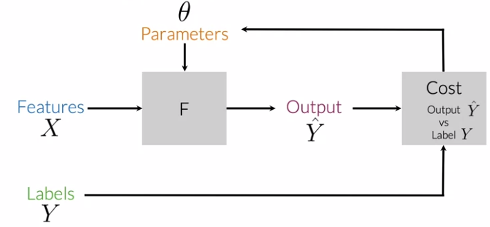
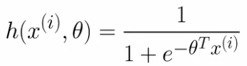
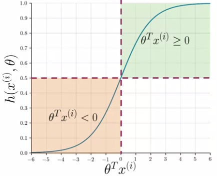
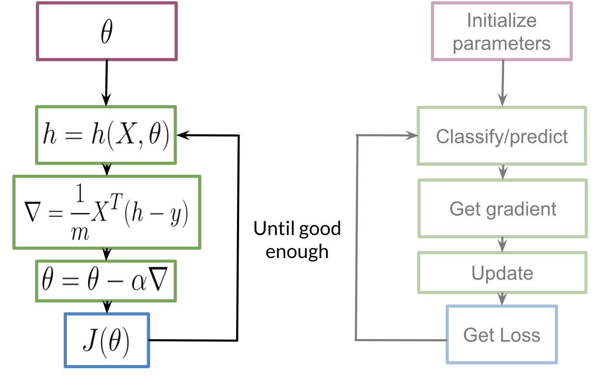
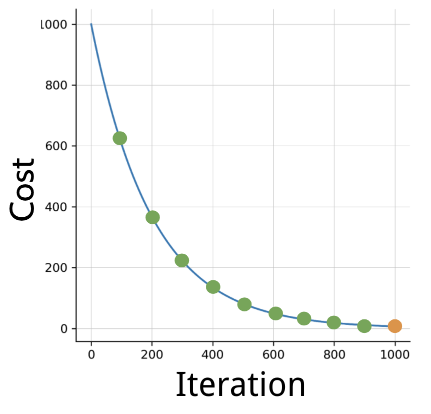
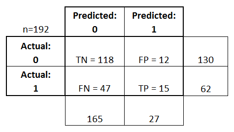
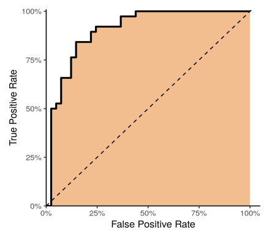
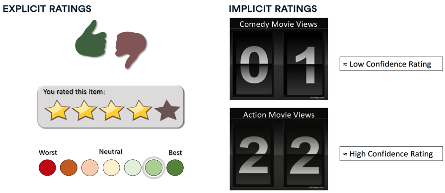

# Machine Learning

  * [Definition:](#definition-)
  * [Types of Machine Learning](#types-of-machine-learning)
  * [Supervised Machine Learning](#supervised-machine-learning)
  * [Classification:](#classification-)
  * [Steps for building a model](#steps-for-building-a-model)
  * [Methods for building model:](#methods-for-building-model-)
    + [Decision Trees](#decision-trees)
    + [Logistic Regression](#logistic-regression)
  * [Tools:](#tools-and-libraries)
  * [Evaluating a Model](#evaluating-a-model)

## Definition:

1. ....
2. It's all about building a model for ML activities:
    1. Classification
    2. Clustering
    3. ...
    
## Types of Machine Learning 

Adopted from [machinelearningmastery.com](https://machinelearningmastery.com/types-of-learning-in-machine-learning/). 

1. **Supervised** -->  learn to operate by mapping between input examples and the target variable --> e.g: classification, regression. 
2. **Unsupervised** --> learn to operate upon only the input data without outputs or target variables --> e.g: clustering, density estimation (summarizing the distribution of data), visualization, projection. 
3. **Reinforcement** --> learn to operate using feedback (reward and punishment). 

All estimators in ML have a `fit()` method, and depending on whether they are supervised or unsupervised, they also have a `predict()` or `transform()` method [source](https://stackoverflow.com/questions/31572487/fitting-data-vs-transforming-data-in-scikit-learn).

## Supervised Machine Learning
1. Get the data and preprocess it. 
2. Split the data into the train and test data. 
3. Train the train data using `.fit()`. 
4. do prediction with `.predict()`. 
5. Evaluate: compute the accuracy. If using Python's sklearn, you can type something like:
    ```
    from sklearn import metrics
    accuracy = metrics.accuracy_score(y_test, y_pred)
    ```
5. Example: classification problems. 
6. How the supervised machine learning works: 
    1. In supervised machine learning, you have input features and a sets of labels. 
    2. To make predictions based on your data, you use a **function** with some parameters to map your features to output labels. 
    3. To get an **optimum mapping** from your features to labels, you **minimize the cost function** which works by **comparing** how closely your output **Y hat** is to the **true labels Y** from your data. 
    4. After which the parameters are updated and you repeat the process until your cost is minimized.
     <br />
8. df

## Classification:

1. Definition: ....
2. How?
    1. Decision Trees. 
    2. Logistic Regression
        1. make a binary predicition.
        2. Logistic regression makes use of a **sigmoid** function which outputs a probability between **zero** and **one**. The sigmoid function used to classify in **logistic regression H** and it depends on the **parameters Theta** and then the features **vector X superscripts i**, where i is used to denote the ith observation or data points. In the context of tweets, that's the ith tweets. The sigmoid function is visualized as follows:<br />
         <br />
        3. Sigmoid function can also be visualized as follows: <br />
         <br />
        4. The training process happens as follows: <br />
          <br />
        You initialize your parameter \thetaθ, that you can use in your sigmoid, you then compute the gradient that you will use to update \thetaθ, and then calculate the cost. You keep doing so until good enough. Usually you keep training until the cost converges. If you were to plot the number of iterations versus the cost, you should see something like this: <br />
        
        5. df
    3. Gradient-Boosted Tree

## Steps for building a model

1. Split the data into `training data` and `testing data`. 
2. Build model using the appropriate methods --> **fit and transform**. 
3. Use the model to make prediction
4. Evaluate the model. 

## Methods for building model:

### 1. Decision Trees

1. concept: iterative splits

### 2. Logistic Regression

### 3. Multinomial Naive Bayes (MultinomialNB)

1. Conditional probabilities could be interpreted as the probability of an outcome B knowing that event A already happened. Or given that I'm looking at an element from set A, the probability that it also belongs to set B. 
2. Laplacian smoothing --> to avoid probabilities become zero. It requires the number of unique words in the vocabulary.

## Tools and Libraries:

1. sklearn

## Evaluating a Model

1. Confusion Matrix and Accuracy. <br />

     <br />
    *Image is taken from [researchgate.net](https://www.researchgate.net/figure/Confusion-Matrix-Example-Confusion-matrix-terminology-True-positive-Positively-predicted_fig4_328567484)*

    A confusion matrix gives a useful breakdown of predictions versus known values. It has four cells which represent the counts of:
    1. True Negatives (TN) — model predicts negative outcome & known outcome is negative
    2. True Positives (TP) — model predicts positive outcome & known outcome is positive
    3. False Negatives (FN) — model predicts negative outcome but known outcome is positive
    4. False Positives (FP) — model predicts positive outcome but known outcome is negative.
    
    **Accuracy** = (TN + TP) / (TN + TP + FN + FP)
    
2. Precision and Recall 
    1. Precision = TP / (TP + FP) --> proportion of positive predictions which are correct. *For all flights which are predicted to be delayed, what proportion is actually delayed?*
    2. Recall = TP / (TP + FN) --> proportion of positives outcomes which are correctly predicted. *For all delayed flights, what proportion is correctly predicted by the model?*

3. Receiver Operating Characteristic (ROC) <br />
     <br />
    
    1. a curve describing TP versus FP
    2. threshold = 0 (top right) and 1 (bottom left). 
    3. area under ROC is called **area under the curve (AUC)**. 
    4. ideally, AUC = 1. 

## Vectorization in Machine Learning
1. optimization algorithm
2. 

## Recommendation Systems:

### 2 Types of Filtering:
1. Content-based filtering: Based on descriptive tags (features) of items, such as `user ratings`, `language`, and `genre`. 
2. Collaborative Filtering

### 2 Types of Rating:
1. explicit rating
2. implicit rating



## Still confused:
1. vectorizer vs classifier?
2. 
