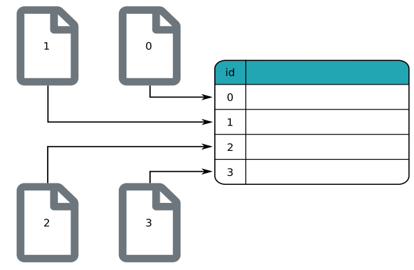
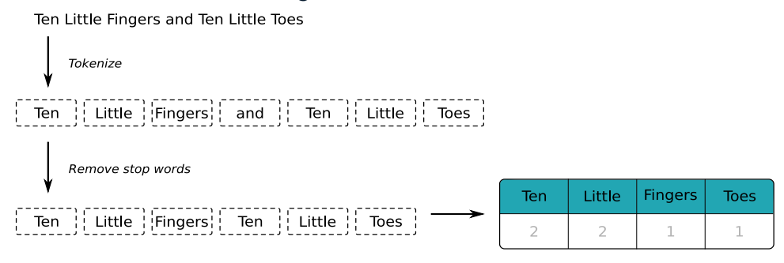
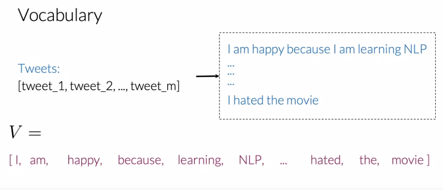
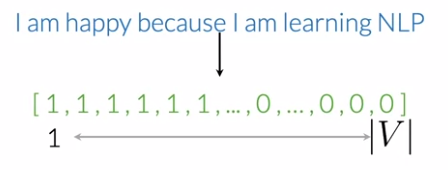

# Natural Language Processing (NLP)

## Definition

## Turning Text into Tables
  

## Steps
1. building vocabulary
2. remove punctuation and numbers
3. tokenize (split into individual words)
4. remove stop words
5. apply the hashing trick.  
  The hashing trick provides a fast and space-efficient way to map a very large (possibly infinite) set of items onto a smaller, finite number of values.
5. convert to TF-IDF (term frequency–inverse document frequency) representation.  
  The TF-IDF matrix reflects how important a word is to each document. It takes into account both the frequency of the word within each document but also the frequency of the word across all of the documents in the collection. The closer IDF of a word is to 0, the more common that word is. 
  
## NLP Preprocessing:
1. remove stop words & punctuations.
2. (if necessary): remove URLs and tweet handles. 
3. tokenize (split into individual words)
4. lower casing all capitals
5. stemming --> convert every word to its stem  --> e.g: dancer, dancing, danced, becomes 'danc' ;  tune, tuned, tuning, becomes 'tun'. --> You can use porter stemmer to take care of this. 

## Tools:

### 1. Python and Pyspark

Libraries:
1. `from pyspark.ml.feature import StopWordsRemover, HashingTF, IDF`
2. `from pyspark.sql.functions import regexp_replace`
3. gensim
4. nltk
5. spacy

## NLP & Classification:
1. Got a bunch of texts. It can be tweets, etc. 
2. Create a vocabulary `V` which is the list of unique words from that bunch of texts. This vocabulary will allow us to encode any text or any tweet as an array of numbers. 
    
3. Do feature extraction. Check if every word from your vocabulary appears in the text (tweets, etc). If it does, assign a value of `1` to that word (feature). If it doesn't, assign the value of `0`. This would result in texts represented as vector as depicted in the figure below.  
    
4. represent text as a vector --> vector space models
5. build a classifier
    a. logistic regression classifier
    b. naive bayes classifier
