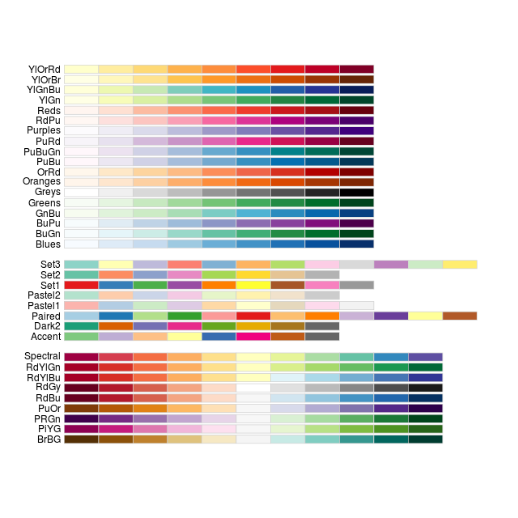

# Working with Colors with R

1. `library(RColorBrewer)`.  
    `display.brewer.all()`. 
    
    
    
2. `library(viridisLite)`.  

3. [`hcl()`](https://www.rdocumentation.org/packages/grDevices/versions/3.6.2/topics/hcl): Create a vector of colors from vectors specifying hue, chroma and luminance. 

# Wokring with Colors with Python
