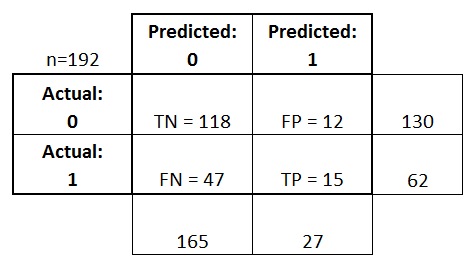

# Machine Learning

## Definition:

1. ....
2. It's all about building a model for ML activities:
    1. Classification
    2. Clustering
    3. ...

## Classification:

1. Definition: ....
2. How?
    1. Decision Trees. 
    2. ...

## Steps for building a model

1. Split the data into `training data` and `testing data`. 
2. Build model using the appropriate methods
3. Use the model to make prediction
4. Evaluate the model. 

## Methods for building model:

### Decision Trees

1. concept: iterative splits

## Tools:

## Evaluating a Model

1. Confusion Matrix.  

      
    *Image is taken from [researchgate.net](https://www.researchgate.net/figure/Confusion-Matrix-Example-Confusion-matrix-terminology-True-positive-Positively-predicted_fig4_328567484)*

    A confusion matrix gives a useful breakdown of predictions versus known values. It has four cells which represent the counts of:
    1. True Negatives (TN) — model predicts negative outcome & known outcome is negative
    2. True Positives (TP) — model predicts positive outcome & known outcome is positive
    3. False Negatives (FN) — model predicts negative outcome but known outcome is positive
    4. False Positives (FP) — model predicts positive outcome but known outcome is negative.
     
    Accuracy = (TN + TP) / (TN + TP + FN + FP)
2. df
