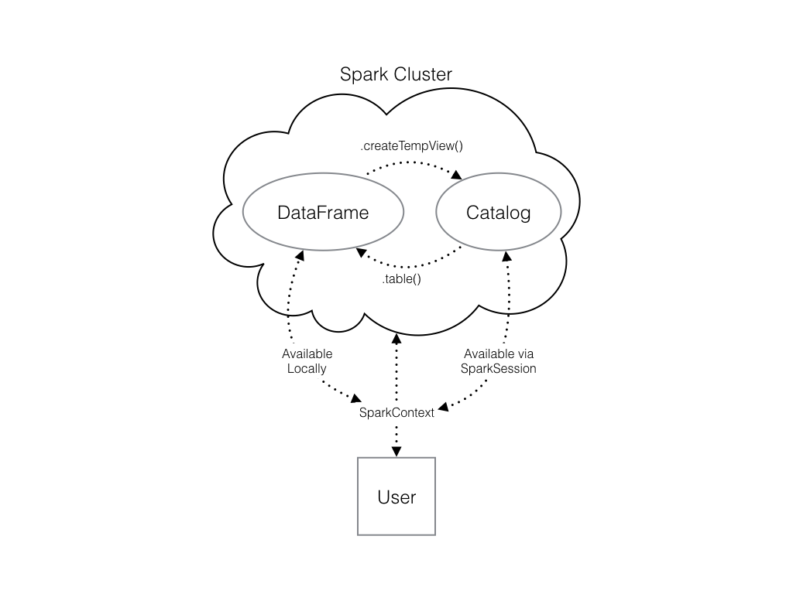

# Pyspark Notes. 

## Steps:

1. Connecting to a cluster and getting to know `SparkContext`. 

    1. A cluster consists of **a master and workers**. To connect to a cluster, we first have to create a connection to the `SparkContext`. <br />
    2. Creating the connection is as simple as creating an instance of the `SparkContext` class, with `SparkConf()` constructor. 
    
2. Import necessary library
    ```
    # Import SparkSession from pyspark.sql
    from pyspark.sql import SparkSession
    ```
    
3. The **SparkSession** <Br />
    1. create a `SparkSession` object from your `SparkContext`.
    2. think of the `SparkContext` as your connection to the cluster (main entry point for creating RDDs) and the `SparkSession` as your interface with that connection.
    3. SparkSession provides a single point of entry to interact with Spark DataFrames.
    4. SparkSession is used to create DataFrame, register DataFrames, execute SQL queries.
    5. SparkSession is available in PySpark shell as spark
    6. Example: 
    ```
    # Create my_spark
   spark = SparkSession.builder.getOrCreate()
    ```

4. Start poking around to see what tables is in your cluster using `spark.catalog.listTables()`. Please note that `spark` is the intance of the SparkSession. 

5. Query something from your data using `spark.sql(query)`.
    ```
    # Don't change this query
    query = "SELECT origin, dest, COUNT(*) as N FROM flights GROUP BY origin, dest"

    # Run the query
    flight_counts = spark.sql(query)
    flight_counts.show()
    ```
    
6. If necessary, convert the result to Pandas dataframe using `.toPandas()`. 
    ```
    # Convert the results to a pandas DataFrame
    pd_counts = flight_counts.toPandas()

    # Print the head of pd_counts
    print(pd_counts.head())
    ```
    
7. convert from Pandas dataframe to Spark dataframe, using `spark.createDataFrame(pandas_df)`. <br />
    However, the output of this method is stored locally, not in the `SparkSession` catalog. This means that you can use all the Spark DataFrame methods on it, but you can't access the data in other contexts. <br />
    For example, a SQL query (using the `.sql()` method) that references your DataFrame will throw an error. <br />
    To access the data in this way, you have to save (register) it to the `SparkSession` as a temporary table using the method `.createOrReplaceTempView()`. See the illustration below. 
    

8. read a csv file: `spark.read.csv(file_path, header=True)`. 

## More about `SparkContext`.

A **SparkContext** is the entry point to Spark functionality, like a key to your car. SparkContext is automatically created by PySpark in the PySpark shell ( you don't have to create it by yourself) and is **exposed via a variable `sc`**. <br />
`sc` has several properties such as `sc.version`, `sc.pythonVer`, `sc.master`. <br />
`sc` also has several methods such as `sc.parallelize()` and `sc.textFile()`. 

## About RDD

1. RDD stands for resilient distributed dataset. RDD is the Spark's core data structure. It is an immutable distributed collection of objects.
2. RDD can be created using `sc.parallelize()` or `sc.textFile()`. 

    1. `sc.parallelize()` --> Load a list into Spark. <br />
    Example: 
    ```
    # Load the list into PySpark  
    spark_data = sc.parallelize(range(1,10))
    ```
    2. `sc.textFile(file_path, minPartitions)` --> load data from a local file. 
    
3. Remember that RDD are spread into several partitions. Thus, to show the RDD as a whole, use `rdd_name.collect()`. <br />
    Example:
    ```
    In [3]:
    sc.parallelize(range(1,5))
    Out[3]:
    PythonRDD[23] at RDD at PythonRDD.scala:49
    In [4]:
    sc.parallelize(range(1,5)).collect()
    Out[4]:
    [1, 2, 3, 4]
    ```
    
4. What can we do with RDD?
    
    1. `rdd_name.getNumPartitions()` --> get the number of partitions in an RDD. 
    2. `rdd_name.map()` --> The `map()` transformation takes in a function and applies it to each element in the RDD. 
    3. `rdd_name.flatMap()` --> similar to `map()` but it can return > 1 result. 
    4. `rdd_name.filter()`
    5. `rdd_name.count()` --> count the number of items in the RDD. <br />
        Example:
        ```
        In [2]:
        myrdd = sc.parallelize(range(1,5)).count()
        In [3]:
        myrdd
        Out[3]:
        4
        ```
    6. `rdd_name.take(5)` --> show the first n items of the RDD. <br />
        Example:
        ```
        In [5]:
        myrdd = sc.parallelize(range(1,5)).take(3)
        In [6]:
        myrdd
        Out[6]:
        [1, 2, 3]
        ```
     7. `rdd_name.reduceByKey()` --> operates on key, value (k,v) pairs and merges the values for each key.
     8. `rdd_name.sortByKey()`
     9. `rdd_name.countByKey()` --> count the number of keys in a key/value dataset.
        
    


## About Spark DataFrame

1. Spark DataFrame is **immutable**. This means that it can't be changed, and so columns **can't be updated in place**. 

1b. Create spark dataframe using `spark.table()`

2. To overwrite the original DataFrame you must **reassign** the returned DataFrame using the method like so:
    ```
    df = df.withColumn("newCol", df.oldCol + 1)
    ```

3. Do a column-wise operation --> use `.withColumn("column_name")`. 

4. Filtering a spark dataframe based on certain characteristics.
    1. use `.filter("sql_string")` --> example: `flights.filter("air_time > 120")`.
    2. use `.filter(Spark Column of boolean)` --> example: `flights.filter(flights.air_time > 120)`.
    
5. Spark only handles numeric data. That means all of the columns in your DataFrame must be either integers or decimals (called 'doubles' in Spark).

6. Print the schema of spark df column: `df.printSchema()`. 

## Other functions

1. Aggregating --> The GroupedData methods --> must be preceded by `.groupBy()`.
    1. ```df.groupBy().min("col").show()```
    2. ```df.groupBy().max("col").show()```
    3. ```df.groupBy().count("col").show()``` <br />
    4. `.avg()` --> `flights.filter("carrier == 'DL'").filter("origin == 'SEA'").groupBy().avg("air_time").show()`. 
2. `.cast()`  --> convert all the appropriate columns from your DataFrame model_data to integers. 
3. `.parallelize()` --> load internal-source data into a spark dataframe. Example: <br />
    ```
    numb = range(1, 100)
    spark_data = sc.parallelize(numb)
    
    RDD = sc.parallelize(["Spark", "is", "a", "framework", "for", "Big Data processing"])
    ```
4a. `.textFile(minPartitions = 5)` --> Create an RDD file from a local file consists of 5 partitions. Example: `lines = sc.textFile(file_path)` or `lines = sc.textFile(/usr/local/share/datasets/README.md')`

4b. `spark.createDataFrame(data, schema=None, samplingRatio=None, verifySchema=True)` --> Create a Spark dataframe. Please note that we use the object `spark` (a spark session) instead of `sc` (a spark context). The argument `schema` is a list of column names.

5. `.getNumPartitions()` --> check the number of partitions in an RDD file. Example: `fileRDD.getNumPartitions()`.
6. `.collect()` --> retrieve all the elements of the dataset from all nodes to the driver node. `.collect()` is usually used after `filter()`, `group()`, `count()`, `map()`, etc. 
7. `.reduceByKey()` --> operates on key, value (k,v) pairs, then combine & merges the values for each key <br />
    Example:
    ```
    # Create PairRDD Rdd with key value pairs
    Rdd = sc.parallelize([(1,2), (3,4), (3,6), (4,5)])

    # Apply reduceByKey() operation on Rdd
    Rdd_Reduced = Rdd.reduceByKey(lambda x, y: x + y)

    # Iterate over the result and print the output
    for num in Rdd_Reduced.collect(): 
      print("Key {} has {} Counts".format(num[0], num[1]))
    ```
    
    Output:
    ```
    Key 1 has 2 Counts
    Key 3 has 10 Counts
    Key 4 has 5 Counts
    ```
    
## Map vs flatMap

1. `.map()` --> one-to-one transformation <br />
    Example: 
    ```
    # Square all numbers in my_list
    squared_list_lambda = list(map(lambda x: x**2, my_list))
    
    # Create map() transformation to cube numbers
    cubedRDD = numbRDD.map(lambda x: x**3)
    ```
2. `.flatMap()` --> one-to [0, 1, many] transformation. <br />
    Example:
    ```
    # Split the lines of baseRDD into words
    splitRDD = baseRDD.flatMap(lambda x: x.split())
    ````
3. 

## Joining 2 dataframes
1. df1.union(df2)


## read and write

1. `spark.read.format('format_name')`  --> eg: `spark.read.format('csv')`.
2. `spark.read.format_name` --> eg: 

    - `spark.read.parquet('asdf.parquet)`.
    - `df_csv = spark.read.csv("file.csv", header=True, inferSchema=True)` --> create a dataframe from a csv file. 
    - `df_txt = spark.read.txt("file.txt", header=True, inferSchema=True)` --> create a dataframe from a txt file.
    - `df_json = spark.read.json("file.json", header=True, inferSchema=True)` --> create a dataframe from a json file.
    - `df = spark.read.format('csv').options(Header=True).load('file_name.csv')`

3. `spark.write.format('format_name_type')` --> eg: `df3.write.parquet('AA_DFW_ALL.parquet', mode='overwrite')`. 

## Select

```
# 1. select distinct
# Show the distinct VOTER_NAME entries
voter_df.select('VOTER_NAME').distinct().show(40, truncate=False)

# 2. Show the distinct VOTER_NAME entries again
voter_df.select('VOTER_NAME').distinct().show(40, truncate=False)
```

## Filter: .filter(), .where(), .where(~ )
```
# `. filter
# Filter voter_df where the VOTER_NAME is 1-20 characters in length
voter_df = voter_df.filter('length(VOTER_NAME) > 0 and length(VOTER_NAME) < 20')

# 2. filter not & contains
# Filter out voter_df where the VOTER_NAME contains an underscore
voter_df = voter_df.filter(~ F.col('VOTER_NAME').contains('_'))

# 3. filter only
users_df = users_df.filter(users_df.Name.isNotNull())

# 3b. filter not
users_df = users_df.filter(~ col('Name').isNull())

# 4. filter where
users_df = users_df.where(users_df.ID == 18502)

# 5. filter where not
users_df = users_df.where(~ (users_df.ID == 18502) )
```

## Creating and Modifying Column

Using `.withColumn()`. Can be varied with `.when()` and `.otherwise()`.

```
# Add a new column called splits separated on whitespace
voter_df = voter_df.withColumn('splits', F.split(voter_df.VOTER_NAME, '\s+'))

# Create a new column called first_name based on the first item in splits
voter_df = voter_df.withColumn('first_name', voter_df.splits.getItem(0))

# Get the last entry of the splits list and create a column called last_name
voter_df = voter_df.withColumn('last_name', voter_df.splits.getItem(F.size('splits') - 1))

# Add a column to voter_df for any voter with the title **Councilmember**
voter_df = voter_df.withColumn('random_val', F.when(voter_df.TITLE == 'Councilmember', F.rand()))

# Add a column to voter_df for a voter based on their position
voter_df = voter_df.withColumn('random_val',
                               when(voter_df.TITLE == 'Councilmember', F.rand())
                               .when(voter_df.TITLE == 'Mayor', 2)
                               .otherwise(0))
```

### Dropping/Removing a Column
```
# Drop the splits column
voter_df = voter_df.drop('splits')
```
