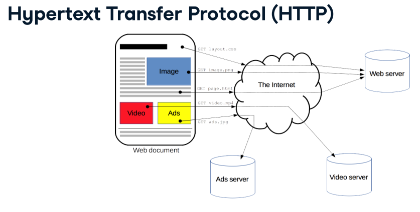
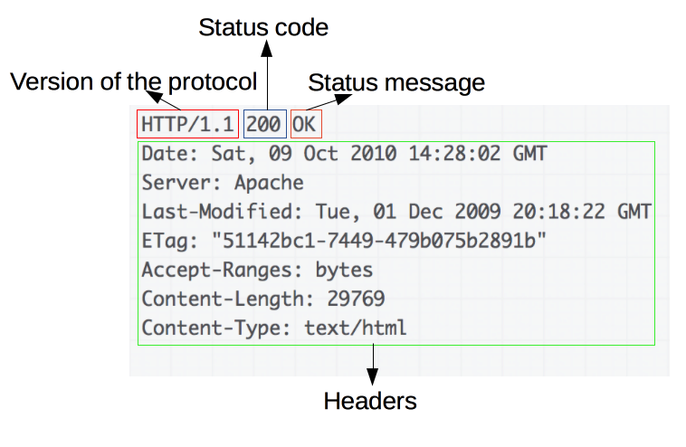

# Web Scraping

- [Understanding Basic HTTP](#understanding-basic-http)
- [Understanding Basic Web](#understanding-basic-web)
- [The Ethics](#the-ethics)

## Understanding Basic HTTP

*[https://developer.mozilla.org/en-US/docs/Web/HTTP/Overview](https://developer.mozilla.org/en-US/docs/Web/HTTP/Overview)*

## Understanding Basic Web

*[https://developer.mozilla.org/en-US/docs/Web/HTTP/Overview](https://developer.mozilla.org/en-US/docs/Web/HTTP/Overview)*

### Web Component:
1. Server
2. Client, e.g. browsers (Firefox, Chrome, etc.), crawler, [CURL](https://en.wikipedia.org/wiki/CURL), headless browser ([PhantomJS](https://phantomjs.org/), [Selenium](https://www.selenium.dev/)). 
3. A request is sent to the web server. Example of a request:
    
4. Server replies with a response, which is the web page that we see. 
    1. in the page: header, body, footer. 
    2. header provides: [status code and status message](https://developer.mozilla.org/en-US/docs/Web/HTTP/Status). Response status codes are grouped into 5 classes:
        1. Informational responses (100–199), e.g.: 101 = "switching protocol"
        2. Successful responses (200–299), e.g.: 200 = "OK"
        3. Redirects (300–399), e.g.: 301 = "moved permanently"
        4. Client errors (400–499), e.g.: 403 = "forbidden", 404 = "not found"
        5. Server errors (500–599), e.g.: 500 = "internal server error", 504 = "gateway timeout". 
    3. Example of response:
    
    *[https://developer.mozilla.org/en-US/docs/Web/HTTP/Overview](https://developer.mozilla.org/en-US/docs/Web/HTTP/Overview)*

## The Ethics

1. Tell who you are through the user agent
2. Be gentle and add wait time between requests --> don't overwhelm the server. 

## Tools

1. R --> Required libraries:
    1. rvest
    2. rselenium
    3. [httr](https://www.rdocumentation.org/packages/httr/versions/1.4.2): tools for working with URLs and HTTP
    4. [htmltools](https://www.rdocumentation.org/packages/htmltools/versions/0.5.0): tools for HTML generation and output. <br />
        Some of its important functions:
        1. save_html(html, file, background = "white", libdir = "lib")[https://www.rdocumentation.org/packages/htmltools/versions/0.5.0/topics/save_html]: Save the specified HTML object to a file. 
    5. tidyverse:
        1. 
    6. [textreadr](https://www.rdocumentation.org/packages/textreadr/versions/1.0.2) --> html_read. 
2. python --> scrapy, beautiful soup. 


## Steps:
1. Check your browser's user agent. We can do this by harnessing a special test platform address [**https://httpbin.org/headers**](https://httpbin.org/headers) that returns the headers of each request that it reaches. User agent can be customized to make it meaningful for the owners of the website you're scraping.<br />
    Example:
    ```
    # Access https://httpbin.org/headers with httr
    response <- GET('https://httpbin.org/headers')
    # Print its content
    print(content(response))
    ```
    Output:
    ```
    $headers
    $headers$Accept
    [1] "application/json, text/xml, application/xml, */*"

    $headers$`Accept-Encoding`
    [1] "deflate, gzip"

    $headers$Host
    [1] "httpbin.org"

    $headers$`User-Agent`
    [1] "libcurl/7.47.0 r-curl/4.3 httr/1.4.2"

    $headers$`X-Amzn-Trace-Id`
    [1] "Root=1-5fecea90-2502f62e7222025f605f9d58"
    ```
    From the example above, we can see that the user agent is `libcurl/7.47.0 r-curl/4.3 httr/1.4.2`.
2. read the HTML File. You can do it by several options:
    1. using `read_html(url)` function from library `textreadr()` and assign it to a variable. 
        Example:
        ```
        library(textreadr)
        myhtml <- read_html("https://www.atlasai.co/")
        ```
    2. using `GET(url = NULL, config = list(), ...)` from library `httr`. <br />
        1. Arguments:
            1. url = url of the page to retrieve, write as string (enclosed in quotes). 
            2. config = Additional configuration settings such as http authentication (`[authenticate()](https://www.rdocumentation.org/link/authenticate()?package=httr&version=1.4.2&to=%3Dauthenticate)`), additional headers (`[add_headers()](https://www.rdocumentation.org/link/add_headers()?package=httr&version=1.4.2&to=%3Dadd_headers)`), cookies (`[set_cookies()](https://www.rdocumentation.org/link/set_cookies()?package=httr&version=1.4.2&to=%3Dset_cookies)`) etc. See `[config()](https://www.rdocumentation.org/link/config()?package=httr&version=1.4.2&to=%3Dconfig)` for full details and list of helpers
            3. ... = various optional arguments, such as:
                1. `user_agent('customized user agent')` --> example: `response <- GET('https://httpbin.org/user-agent', user_agent("Erika user agent"))`. <br />
                Alternative way to modify `user agent` is by setting it globally using ``set_config(add_headers(`User-Agent` = "the modified user agent"))``.  <br />
                Example:
                ```
                # Globally set the user agent
                set_config(add_headers(`User-Agent` = "A request from a DataCamp course on scraping"))
                # Pass a custom user agent to a GET query to the mentioned URL
                response <- GET("https://httpbin.org/user-agent")
                # Print the response content
                content(response)
                ```
          
        2. Example:
        ```
        library(httr)
        myhtml <- GET("https://www.atlasai.co/")
        ```

3. Check the [status code](https://en.wikipedia.org/wiki/List_of_HTTP_status_codes) of the response using function `status_code()` from library `httr`. <br />
    Example:
    ```
    > status_code(myhtml)
    [1] 200
    ```
4. Parse the reading response into an HTML doc.   
    1. using the function `html_nodes()` from library `htmltools`. 
        ```
        myhtml %>%
          html_nodes()
        ```
    2. using `content()` from library `httr`. 
        Example:
        ```
        content(myhtml)
        ```
5. Extract the intended nodes using function `html_nodes()` and `html_text()` from library `rvest`. <br />
    Example: 
    ```
    myhtml %>% 
        html_nodes(xpath = '//table//tr[position() = 9] /td') %>% 
        html_text()
    ```
    

## Extracting function
1. html_node()
2. html_nodes(args)  --> args = css selectors or xpath. 
  a. using css selector: `html_nodes('div p')`.
  b. using xpath: `html_nodes(xpath = '//div//p')`.
3. html_text()
4. html_table()
5. read_html() -->  issues an HTTP GET request if provided with a URL. 

All the function above can be combined together. Example: 
```
# extracting table from html
mytable <- myhtml %>% 
  html_node(xpath = "//table") %>% 
  html_table()
# Print the contents of the role data frame
print(mytable)
```

## Selectors

Select intended node using css selectors or xpath wrapped as argument(s) in method `html_nodes()`. 

### css selectors

1. Selecting nodes or component using either:
    1. type (e.g.: `p`, `h2`)
    2. class (`.`)
    3. id (`#`)
    4. or combination of the four things above. 
2. Using selectors:
    1. selecting 1 type --> `html %>% html_nodes('type')`.
    2. selecting > 1 types, seperate them by comma (`,`) --> `html %>% html_nodes('type1, type2')`.
    3. all, use `*` --> `html %>% html_nodes('*')`.
    4. select by class (`.`) --> `html %>% html_nodes('.alert')`.
    5. select by > 1 class (`.class1.class2`) --> `html %>% html_nodes('.alert.emph')`.
    6. select by id (`#`) --> `html %>% html_nodes('#special')`.
    7. select by type and class (`type.class`) --> `html %>% html_nodes('a.alert')`.
    8. select by type and id (`type#id`) --> `html %>% html_nodes('div#special')`.
    9. select by element's position (`pseudo-class`):
        1. first (`:first-child`) --> `html %>% html_nodes('li:last-child')`.
        2. last (`:last-child`) --> `html %>% html_nodes('p:last-child')`.
        3. nth (`:nth-child(n)`) --> `html %>% html_nodes('h3:nth-child(5)`.
3. Family combinators:
    1. Structure: `h2#someid {space|>|+|~} .someclass`.
        1. `space`: descendant combinator --> example: `html %>% html_nodes('div.first a')` --> get all `a`s that are the descendant of `div.first`. 
        2. `>` : child combinator --> example: `html %>% html_nodes('div.first > a')` --> Select all `a`s that are direct children of `div.first`. 
        3. `+` : adjacent sibling combinator --> example: 
            1. `html %>% html_nodes('div.first + div')` --> get the `div` which is a sibling of `div.first`. 
            2. HTML:
                ```
                <div>
                    <h1>First</h1>
                    </div>
                    <div>
                    <p>Some text.</p>
                    <p>More text.</p>
                    </div>
                ```
                <br />
                `html %>% html_node()`
        4.  `~` : general sibling combinator --> example: 
            1. `html %>% html_nodes('div.first ~ div')`.
            2. `html %>% html_nodes('div.first ~ *')`.

### xpath

1. start with double slash `//`. Next element use single slash `/`. 
2. specify class, id, css, position, count, etc using **predicate** `[...]`. 
3. provide special predicated functions which are unavailable in the `css selectors` version:
    1. position() --> to select element located in certain position. 
    2. count() --> select element that has certain number of children/siblings/etc. 
    3. text() --> select element that has certain text. 


### css selectors vs xpath

| No 	| css selectors 	| xpath 	| explanation 	|
|:-:	|-	|-	|-	|
| 1 	| div > p.blue 	| //div/p[@class = "blue"] 	| - [..] = predicate<br>- @ for class 	|
| 2 	| ul.list > li:nth-child(5), ul.list > li:last-child, ul.list > li.special 	| //ul[@class = "list"]/li[position() > 4 or @class = "special"] 	| position() =, < , <=, >, >=, !=<br><br>--> for selecting the nth element<br>--> position starts from 1 	|
| 3 	|  	| - //ol/li[position() != 3 and @class = "blue"]<br>- //ol/li[position() != 3 or @class = "blue"] 	| combining xpath: 'and', 'or' 	|
| 4 	| *<br>html %>% html_nodes('*') 	|  	| get all nodes 	|
| 5 	|  p 	| //p 	| find all p 	|
| 6 	| body p 	| //body//p 	| find p that is under body (not necessary be a direct child) 	|
| 7 	| body, p 	|  	| find body and p (no descendant relationship required) 	|
| 8 	| html > body p 	| /html/body//p 	|  	|
| 9 	| div > p 	| //div/p 	|  	|
| 10 	|  	| //div[a] 	| select 'a' that is a direct child of 'div' 	|
| 11 	| span > a.external 	| //span/a[@class = "external"] 	|  	|
| 12 	| #special div   or <br>*#special div 	| //*[@id = "special"]//div 	|  	|
| 13 	| ol > li:nth-child(2) 	| //ol/li[position() = 2] 	|  	|
| 14 	| - 	| - html %>% html_nodes(xpath = '//ol[count(li) = 2]')<br>- html %>% html_nodes(xpath = '//ol[count(li) > 2]') 	| - count()<br>- select element that has certain number of children. In this example, it's 2 	|
| 15 	| #cast td.role 	| //*[@id = "cast"]//td[@class = "role"] 	|  	|
| 16 	| table td.role > text() 	| html_nodes(xpath = '//table//td[@class = "role"]/text()') 	| - text() --> select elements (and their parents) based on their text<br>- text() is put in predicate- apakah yg css selectornya benar? 	|
| 17 	| #cast td.role 	| //*[@id = "cast"]//td[@class = "role" and text() = " (Voice)"] 	| apa 'and' di css selectors? 	|
| 18 	|  	| ..<br>--> html_nodes(xpath = '..') 	| selects the parent of each selected element 	|
| 19 	| .alert.emph<br>--> html_nodes('.alert.emph') 	| //*[@class="alert" and @class="emph"] 	| apakah benar begini cara ngambil 2 class dg xpath? 	|
| 20 	|  	| html_nodes(xpath = 'em[text() = "twice"]' 	| Select all em elements that have "twice" as text 	|
| 21 	| html %>% html_nodes('li:first-child') 	|  	| selecting the first child, in this case, of li element 	|
| 22 	| html %>% html_nodes('li:last-child') 	|  	| selecting the last child, in this case, of li element 	|
| 23 	| html %>% html_nodes('li:nth-child(4)') 	|  	| - selecting the 4th child, in this case, of li element<br>- first-chid, last-child, and nth-child are called pseudo-class 	|
| 24 	| p, div 	|  	| multiple types<br>--> <p>...</p><div>...</div> 	|
| 25 	| .x.y 	|  	| multiple classes<br>--> <p class = 'x y'>...</p> 	|
| 26 	| table tr:nth-child(9) > td 	| html_nodes(xpath = '//table//tr[position() = 9] /td') 	|  	|

### Resources:
1. [https://developer.mozilla.org/en-US/docs/Web/HTTP/Overview](https://developer.mozilla.org/en-US/docs/Web/HTTP/Overview)
